# DateLecture
# DATE and TIME

### *In JS date and time start since 1 Jabuary of 1970*
## For type of creating a date object:
- new Date()
- new Date(millisecond)
- new Date (Date string)
- new Date (year, month,day, hours,min,sec,millisec)

### new Date():
***we can create in here only date*** ex:
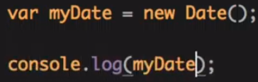
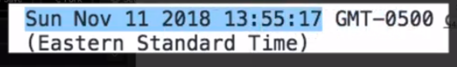

### new Date(**millisecond**):
***-when we put in here a number it start from 1970 by adding millisecond*** ex:
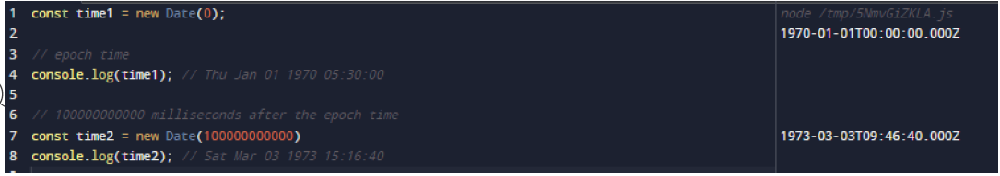

### new Date (**date string**):
***-it show with International Standart (UTC) or (time zone)*** ex:
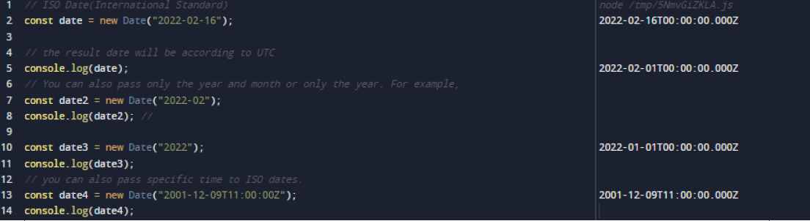

### new Date(**year, month, day, hours, minutes, seconds, milliseconds**):
***-from it is name we can understand that it show time fully***
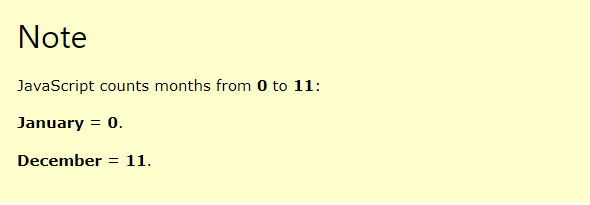
****But in here it show month starting form **0** not form **1** if we want to put January we must to put 0 and finished till **11****** EX:
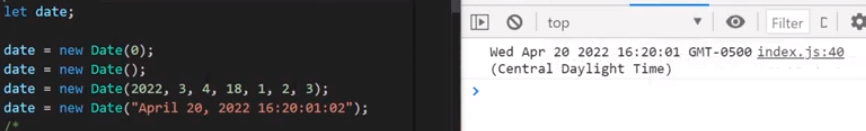

# **DATE METHODS**:
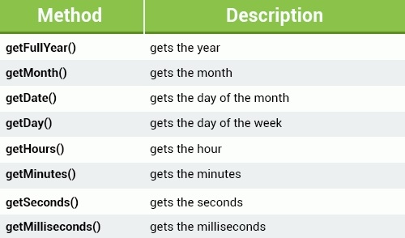

### **now()**
***- it return the number of millisecond since 1970 Jan***  EX:
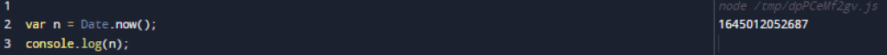
### ***getFullYear()***
***- return only full year of date like (2023)*** EX:
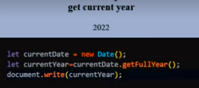
### ***getMonth()***
***- return only month (from *0* until *11*) of the day*** EX:
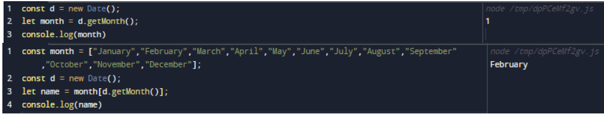

### ***getDate()***
***- shows the day of the month form 1 until 31 of the date*** EX:
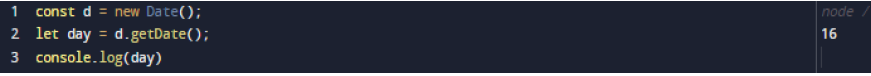

### ***getDay()***
***- Shows the day of the week form 0 till 6 (Sunday,Monday..e.t.c)*** EX:
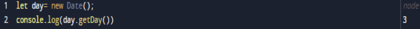
### ***getHours()***
***- Shows hour of the date 0 to 23*** EX:
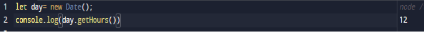

### ***Minutes()***
***- ONly minutes form 0 till 59*** EX:
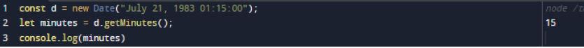

### ***getUTCDate()***
***- show the day of month (1 to 31) and also return in UTC*** EX:

### ***setFullYear()***
***- it set the year of date also set the month and day*** EX:

